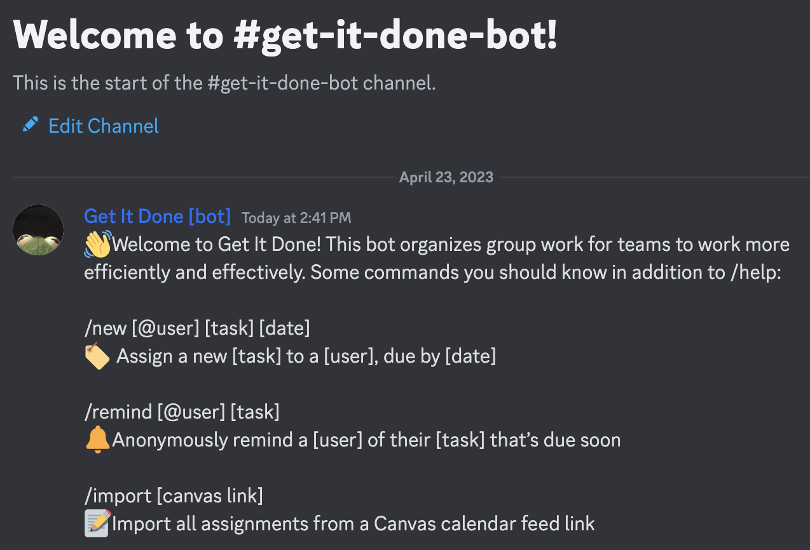
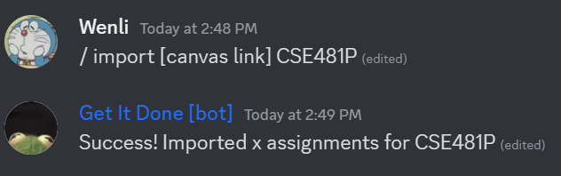
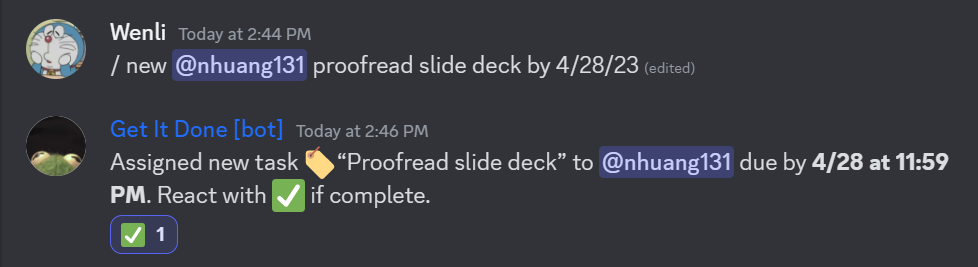
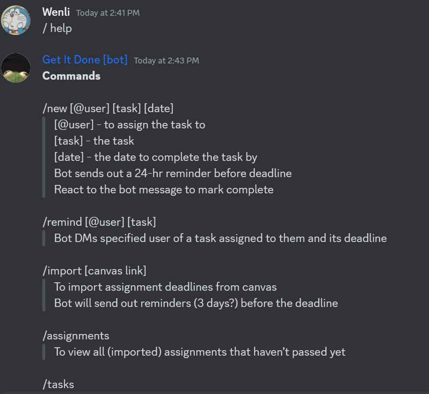
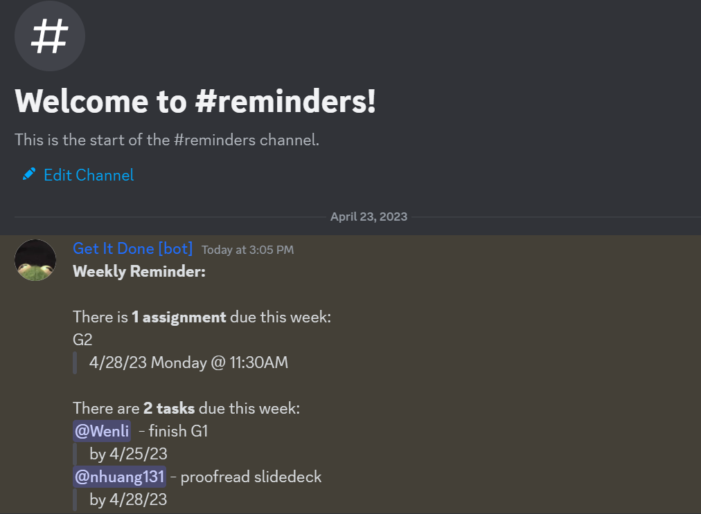
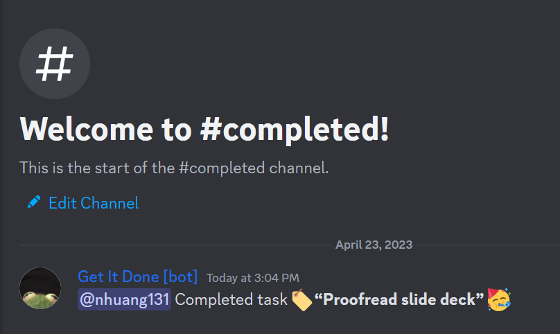

## Overview
The components of our low-fidelity prototype are a Discord server with specified channels (#get-it-done-bot, #reminders, and #completed) and mocked messages sent from our “bot.” One of our group members will act as the mocked Discord bot, typing the expected messages in response to user input. Another part of wizardry is our import command, which is will import deadlines given a Canvas calendar link. For now, we’re mocking this with a dummy link and a mocked success message after the deadlines have been “imported.”
Our channels include:
- #get-it-done-bot: Group members send commands to the bot here. 
- #reminders: The bot sends general team reminders in this channel, including:
  - Weekly Reminders - summary of assignments and tasks for the upcoming week
  - Upcoming deadlines - 24-hour reminders for assignment deadlines & tasks 
- #completed: Completed tasks and assignments will be posted here to track finished items and boost team morale.

## Images of Prototype
*Introduction:* an introductory message sent by the bot upon joining the server

*Importing Assignments:* /import command to import Canvas assignments

*Tasks:* /new command to create and assign a new task

*Help:* /help command to inform users on command usage

*Reminder Channel:* channel where weekly and task/assignment reminders are sent

*Completed Channel:* channel where tasks are sent upon completion

## User Testing
### Goals
Our goals for the Wizard of Oz testing session were to determine the usability of our initial bot design and to identify and improve upon the difficulties users had when using the bot. 

While we as developers had our own definitions of certain terms, we realized that users might think differently. For example, we defined tasks to be smaller steps each assignment broke down into, while assignments were the larger items listed in Canvas. We wanted to find out if users understood the difference between the two.

We also wanted to see how our bot would help improve group productivity and task management. We created a few different tasks for our testers, such as typing commands, interacting with tasks, and navigating our channels. With these, we hoped to identify what users found helpful about our bot, as well as weak points, such as if an action or language was unintuitive. 

### Findings
From the wizard of oz testing session, we found that our bot's commands were fairly straightforward for users. When given a task, such as to assign a user a specific task with a deadline, users correctly used the syntax from our introductory message to type the command. Other tasks included importing deadlines with a dummy Canvas link, assigning themself a task and marking it complete, and reminding a group member of their assigned task. One user did mention that it might be useful to accept a variety of dates and time formats, as users might be unlikely to follow a strict format.

Furthermore, we learned that users were unclear about the distinction between tasks and assignments. We intended tasks to be smaller, individual tasks while assignments were those imported from Canvas, but users found this wording confusing. We also learned that users would find it useful to have one channel with all the tasks listed as they were being created, where they could also go to mark each task complete. Overall, our findings were promising enough to continue with our design, but we will be adjusting it based on feedback.

### Next Steps
**Things to Keep:**

We plan to keep all our commands and most of the functionality that we’ve initially drafted. From our testing, users were able to understand the commands without much help (aside from the distinction between assignments and tasks), and they found the main tasks (pulling assignments from Canvas and organizing individual tasks) useful. While we don’t plan on removing any commands, we may change how they are called. For example, we plan on making the /new command more flexible with the date and time formats it accepts. We also realized after testing that it was unnecessary to have the /remind command take in a specific task as input, since it could just remind the target person of their most urgent task or all of them.

**Things to Change:**

First we will revise the naming of “task” to “to-do” to better differentiate it from “assignment”. We will also make to-do's editable, allowing users to change the to-do item and due date as needed. We will also add a limit to how frequently someone can send a private reminder, to prevent spamming a certain user. Lastly, we will revise the server's channels by replacing the "completed" channel with a "to-do" channel. During testing, there was some confusion with accessing the entire list of to-do items or finding a certain item. Users liked the idea of having a dedicated channel for all to-do items, both complete and incomplete, making it easier to find incomplete items.
