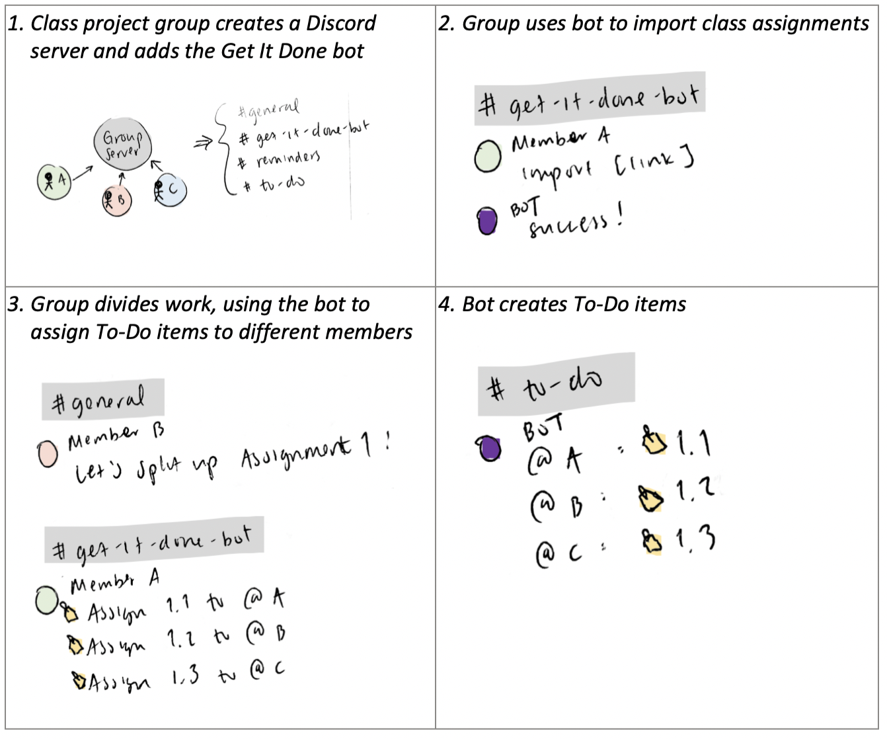
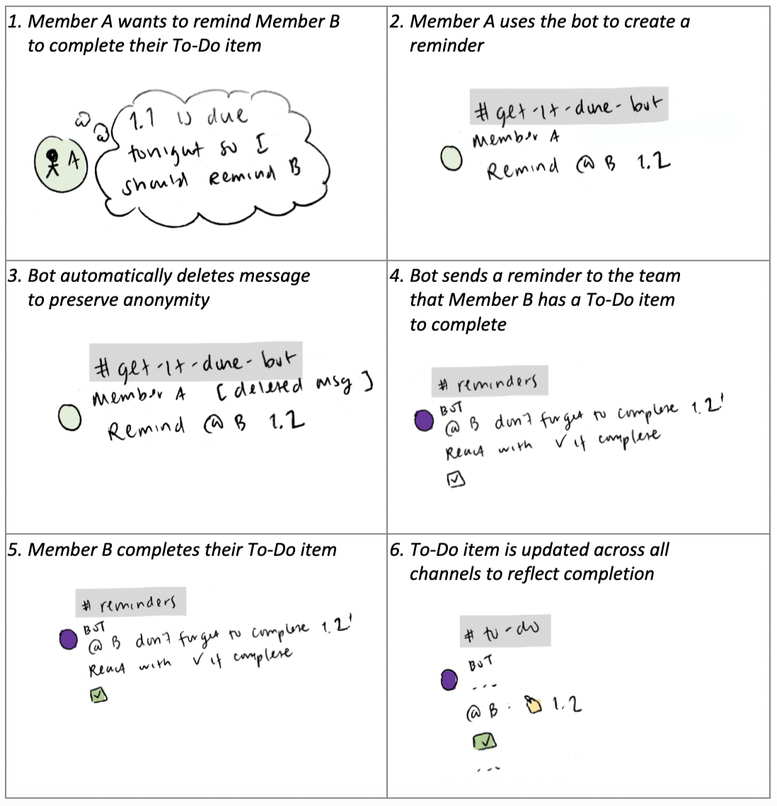
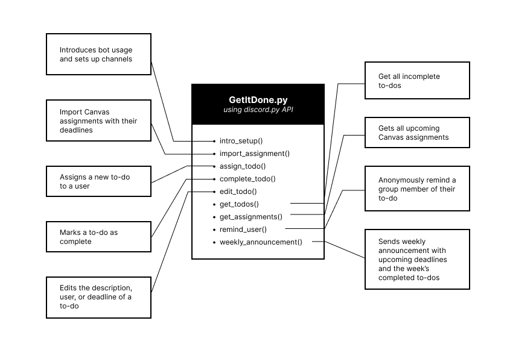
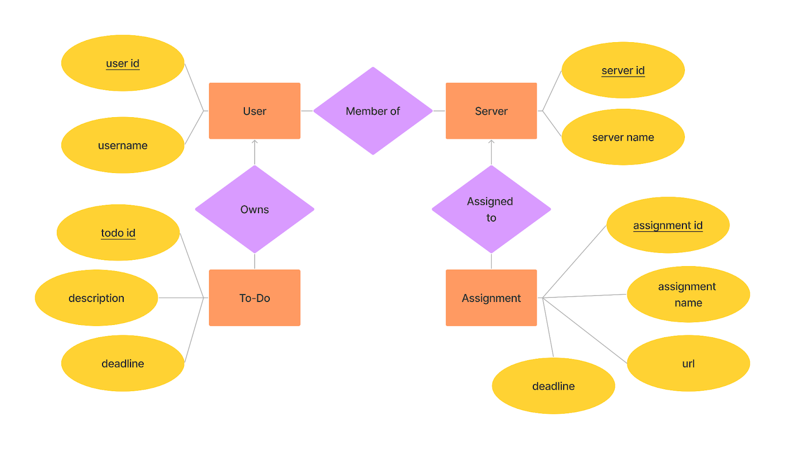

# Code and Design Specification

## Requirements
### Functional Requirements:
- User can import Canvas assignments with their deadlines for a course
- User can view all to-dos, both in general and assigned to them
- User can create a new task and assign to a user
- User can remind someone of an upcoming task
- User can mark to-dos as complete
### Technical Requirements:
- Bot creates persistent channels in the Discord server (#get-it-done-bot, #reminder, #to-do)
- Database storing to-dos and their metadata
- Database storing imported Canvas assignments and their metadata
- Bot can parse imported Canvas calendar for assignments and their deadlines
- Weekly reminders are sent out with upcoming deadlines
### Usability Requirements:
- Bot can be installed on any Discord server
- Bot has introduction message upon installation explaining general usage
- Bot has understandable and concise help text on how to use each command

## Storyboards
**Scenario 1:** Group is formed for class and To-Do items are assigned to members

**Scenario 2:** Group member is anonymously reminded to complete their To-Do item

## Architectural Design
### Components:
- To-do
  - Title
  - Assigned user
  - Deadline
- Assignment
  - Title
  - Deadline
  - Canvas assignment link
- Reminder
  - Upcoming deadlines (weekly)
  - Individual
  - Assignment
  - To-do

### Tech:
- API: discord.py (Python)
  - Event handlers and functions in one file
- DB: SQLite
  - Tables
    - Servers (Primary: SID)
      - Servers the bot is part of
    - Users (Primary: UID)
      - Users in servers that the bot is in
    - UsersInServers (Foreign: SID and UID)
      - Assuming a user can be in multiple servers with the bot, will need extra table (many to many relationship)
    - To-dos (Foreign: UID)
      - The to-dos assigned to each person
    - Assignments (Foreign: SID)
      - The assignments assigned to the whole group
- Functions:
  - intro_setup()
  - import_assignment()
  - assign_todo()
  - complete_todo()
  - edit_todo()
  - get_todos()
  - get_assignments()
  - remind_user()
  - weekly_announcement()

Our project will have to-dos, assignments, and reminder objects. We plan to use the discord.py API for our bot, whose event handlers respond to user commands. These include functions to send an introduction message upon creation and initialize the necessary channels, to import Canvas assignments, to assign, mark complete, and edit to-dos, to get all to-dos or all Canvas assignments, to send a reminder, and to send weekly announcements.

For the backend, we will be using a SQLite database to store information about each user’s assigned to-dos and the assignments that the group (the server) has. This ER diagram maps out the relations between our proposed entities.

## Conclusion
Using the system described above, we are able to fulfill our technical, functional, and usability requirements. Our SQLite database will store each user, to-dos and imported Canvas assignments, along with their corresponding deadlines. As depicted in our storyboard, our Discord bot, written with the discord.py API, will call the corresponding handlers in response to user input. This will fulfill the functions detailed in part 1.

