# Digital Prototype

## Our Problem Space

Many college students dread the same kind of class assignment: group projects. Group projects play a crucial role in fostering collaboration and enhancing learning outcomes. However, they often come with their fair share of challenges. Dividing tasks, maintaining effective communication, and keeping people accountable for their work can be overwhelming, leaving many college students struggling to work productively in group projects. Through our user research, we identified Discord as a platform that students in group projects use to facilitate communication. With this, the question we wanted to answer was: How can we best enhance the experience of students who use Discord for their group projects? 

## Our Solution: *Get It Done*
One crucial feature of Discord is the ability to add bots to servers that can have various functions like automating tasks and interacting with users. Given our problem space, it was natural for us to choose to create a Discord bot, which we’ve named Get It Done. We’ve created a bot that has three main functions: importing and tracking assignments from a course Canvas page, creating and delegating individual tasks (to-dos) to specific group members, and anonymously reminding group members of their to-dos through a direct message from the bot. Our bot can be added to servers through a unique URL, and it will create its own text channels to organize its messages.

## Implementation
To implement our solution, we used the discord.py API wrapper connected to a very lightweight SQLite database to store users, to-dos, and imported Canvas assignments. The discord.py API handled most of the work, allowing us to create slash commands, intake parameters (with help text) from users, and modify the UI of our bot. Our final implementation allows users to import Canvas assignments with their due dates, assign to-dos to users of the server, and anonymously remind a user of an upcoming to-do through the bot’s direct message. Additionally, our implementation has automated general reminders for to-dos and assignments 24 hours before their deadline.

## Accessing Our Prototype
Currently, our bot needs to be run locally. Our codebase can be found [here](https://github.com/UWSocialComputing/get-it-done-code), and you can use [this link](https://discord.com/api/oauth2/authorize?client_id=1106299423883005982&permissions=8&scope=applications.commands%20bot) to invite the bot to a server that you own. Later, we plan on hosting our bot on a platform like Heroku so that no one will need to run it themselves!

## Documentation of Prototype
### On Launch:
Users are introduced to the overall layout of the server, as the bot creates the channels #general, #reminders, #to-do, #assignments, and #bot-commands.

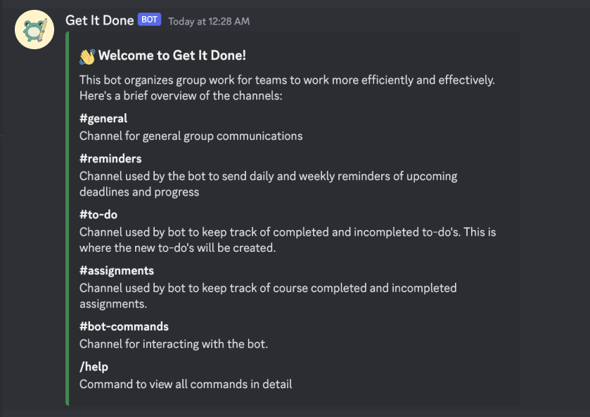
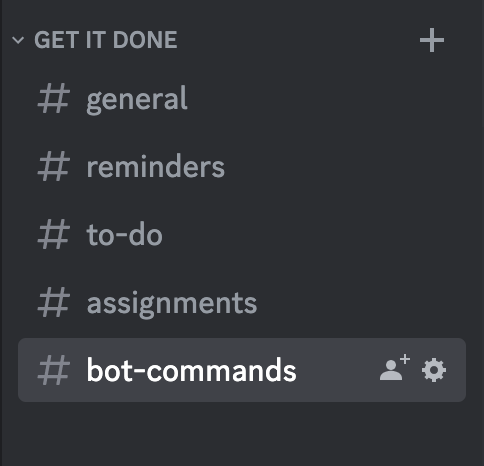

### Importing Canvas Assignments: /import

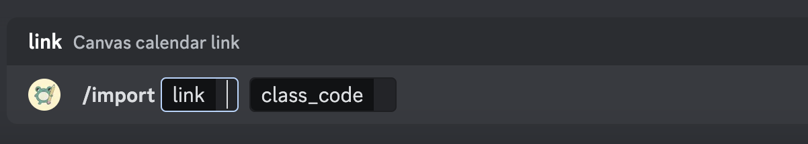
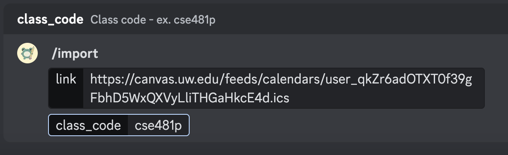

The /import command contains field descriptions so the user knows what information to put. After sending this command, the bot responds with a success message with how many assignments were imported from the class:

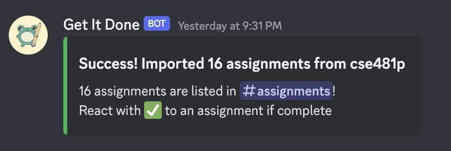

All assignments are now sent as individual messages with their details in embedded objects in the #assignments channel. The embeds allow us to add more details in addition to the assignment’s title, such as the assignment’s Canvas link, the due date and time, and a yellow color to indicate that it’s incomplete. To avoid spam, they are sent as silent messages. 

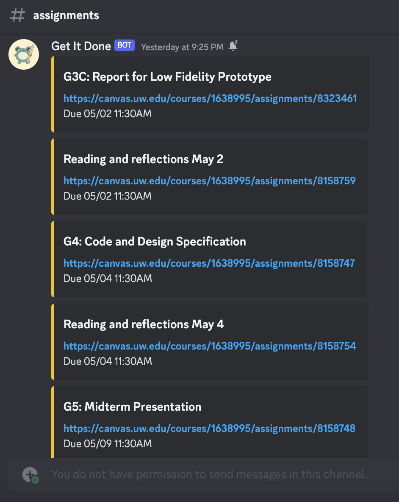

The #assignments channel is read-only so it contains only assignment information. 
We removed the /assignments command and now automatically list assignments for users to view in the #assignments channel. Assignments are now stored in our database users can’t import the same items more than once. 

When users complete assignments, they can react to the assignment message with ✅ to mark it complete. This edits the embed by changing the color to green and labeling it with “COMPLETE”: 

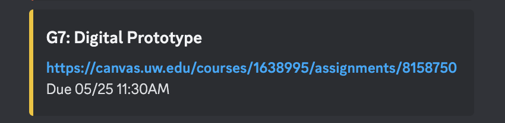
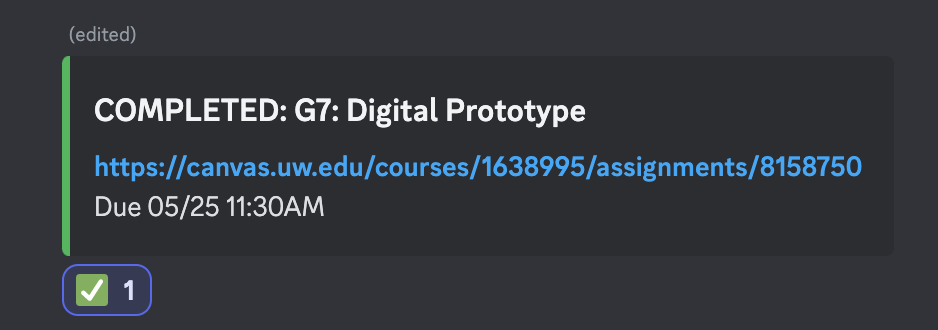

Removing the green check mark reverts the message embed to its original state: 

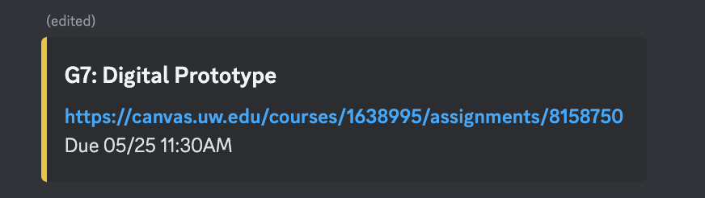

### Creating New To-Dos: /new
Using /new to create a new to-do and /to-dos to view to-dos (either their own or of a group member).

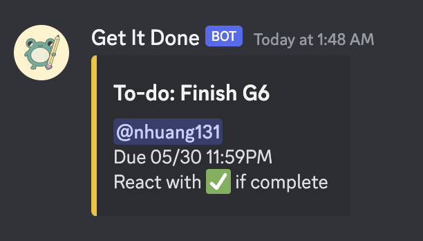
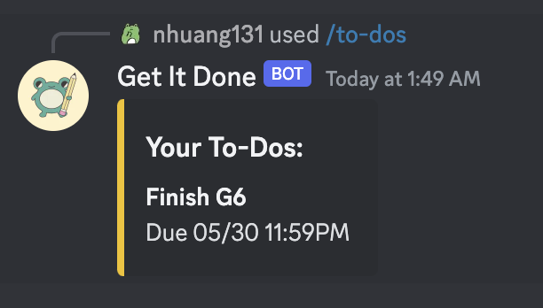

Like assignments, users mark a to-do as complete by reacting with a green check mark, with the ability to also remove that reaction.

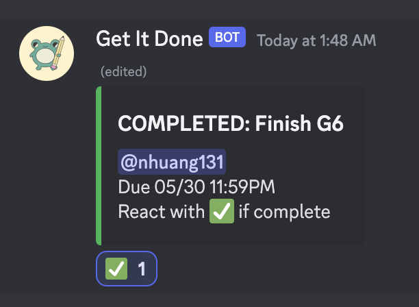
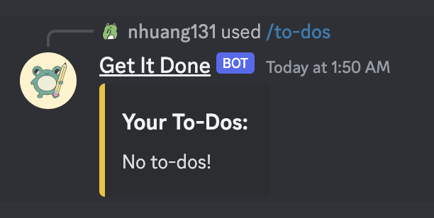

### Getting Help: /help: 
Using the /help command to view a detailed description of how to use each command, sent ephemerally.

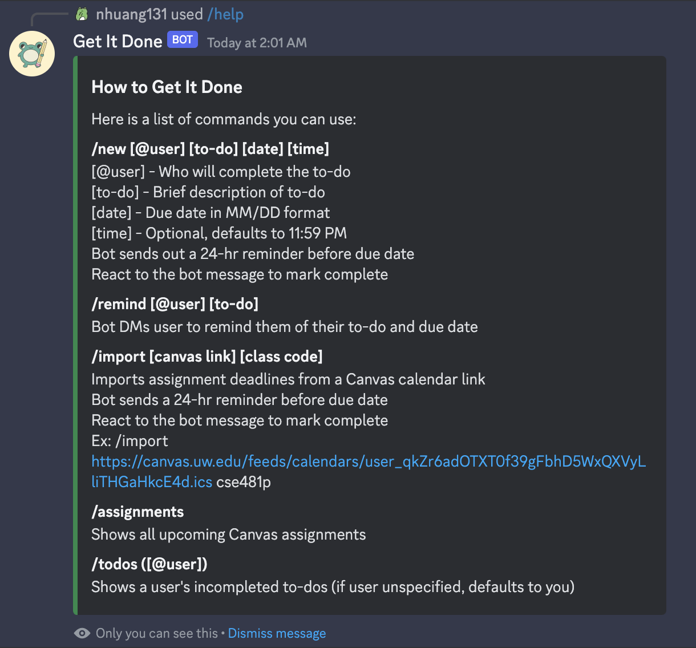
